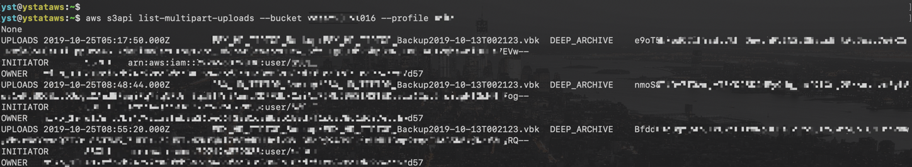
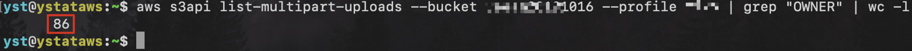
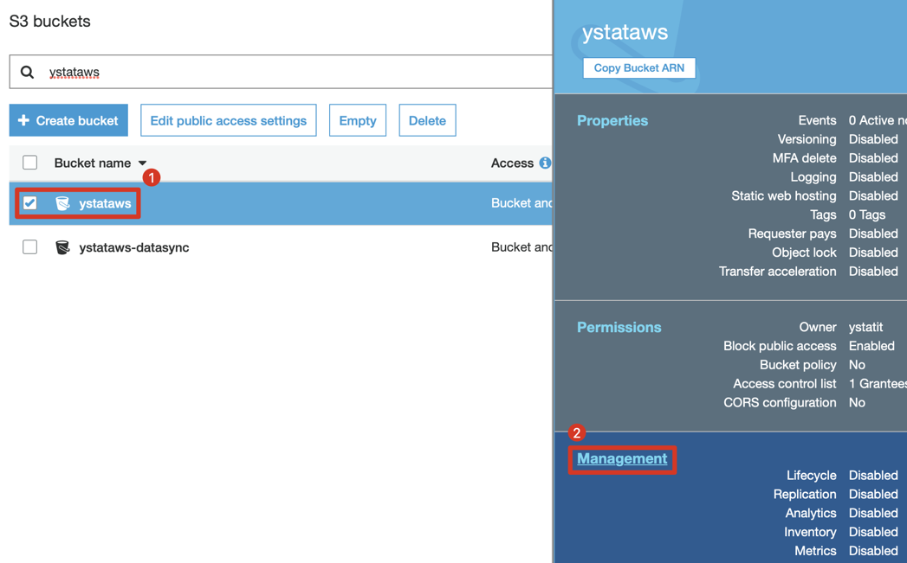
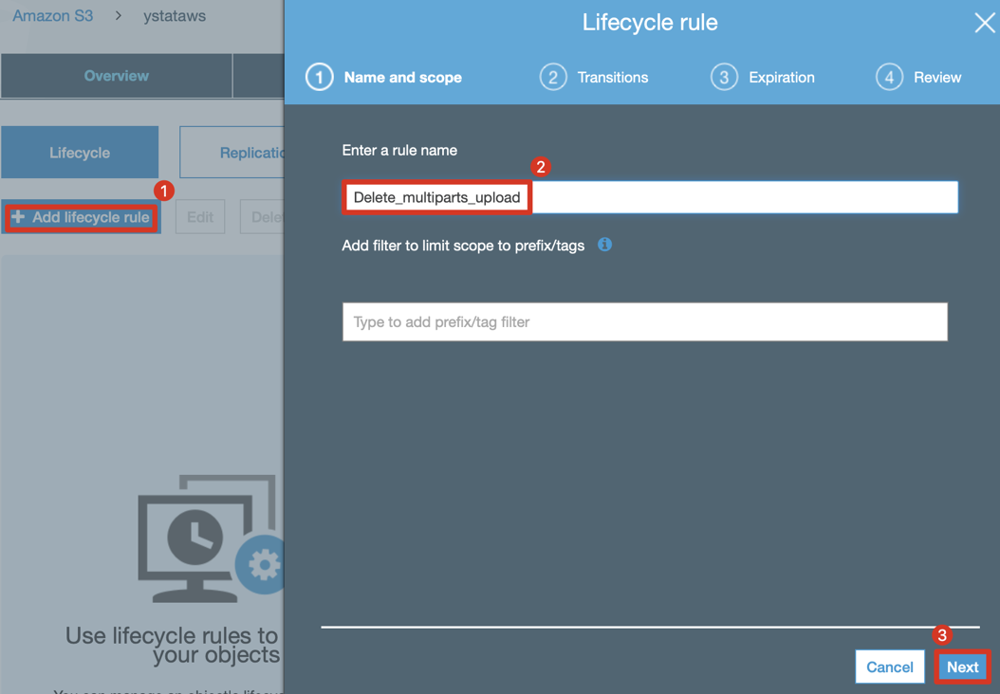
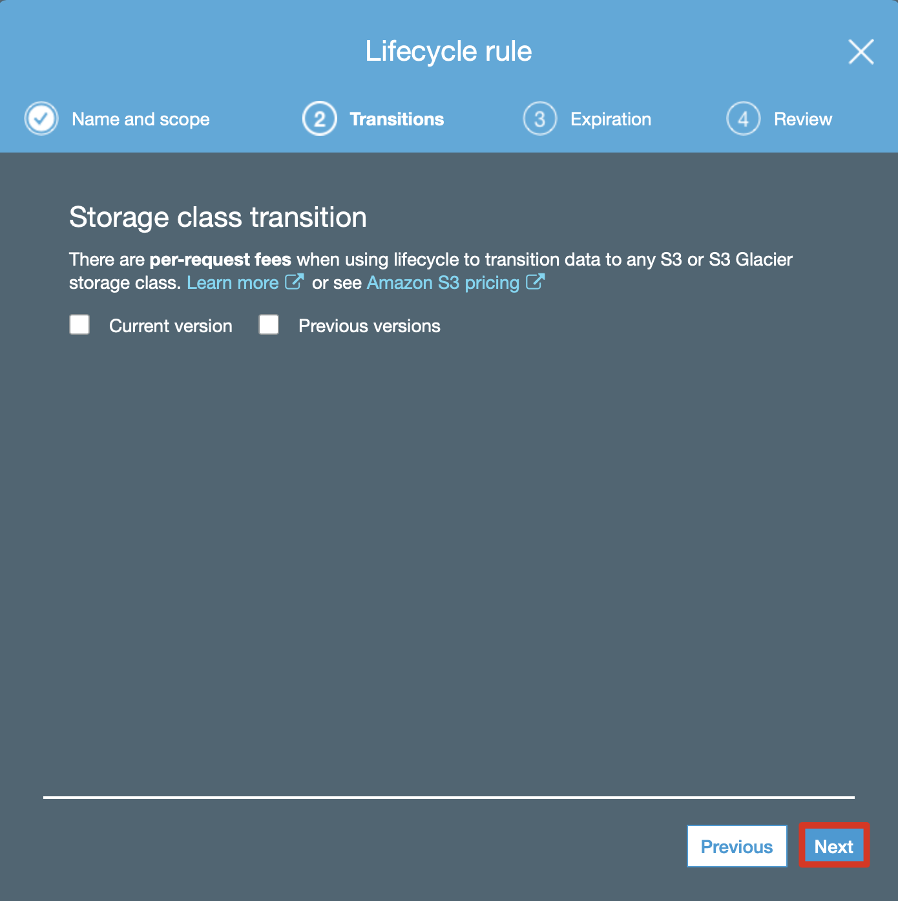
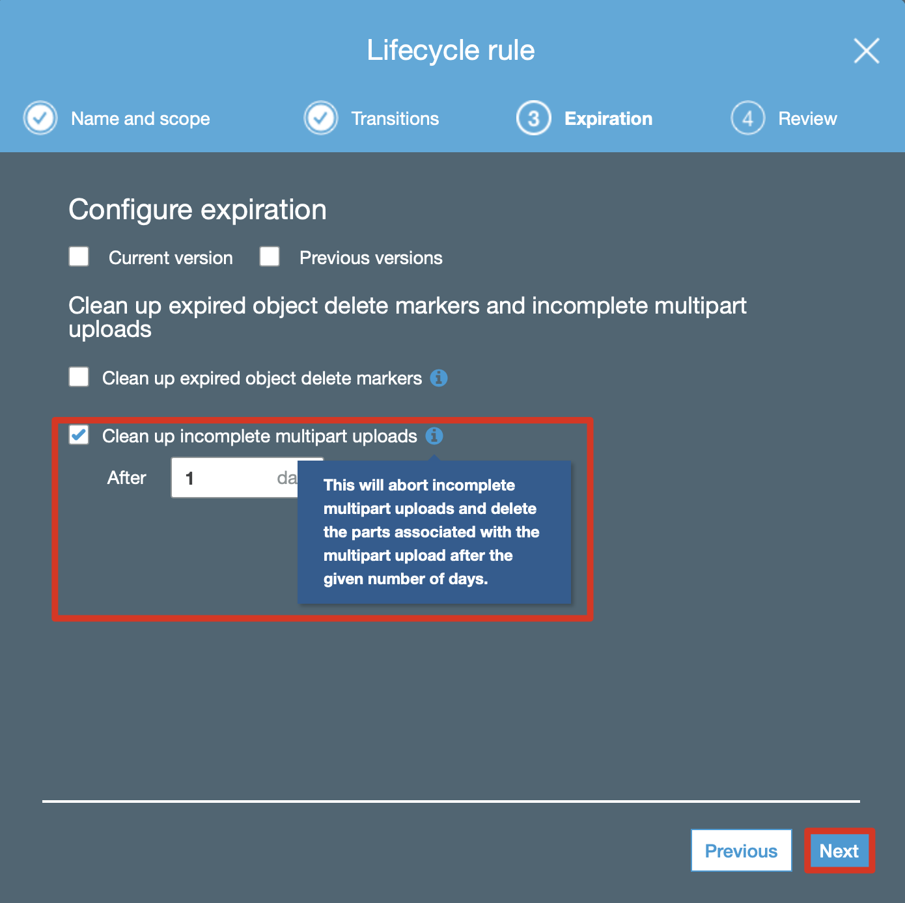
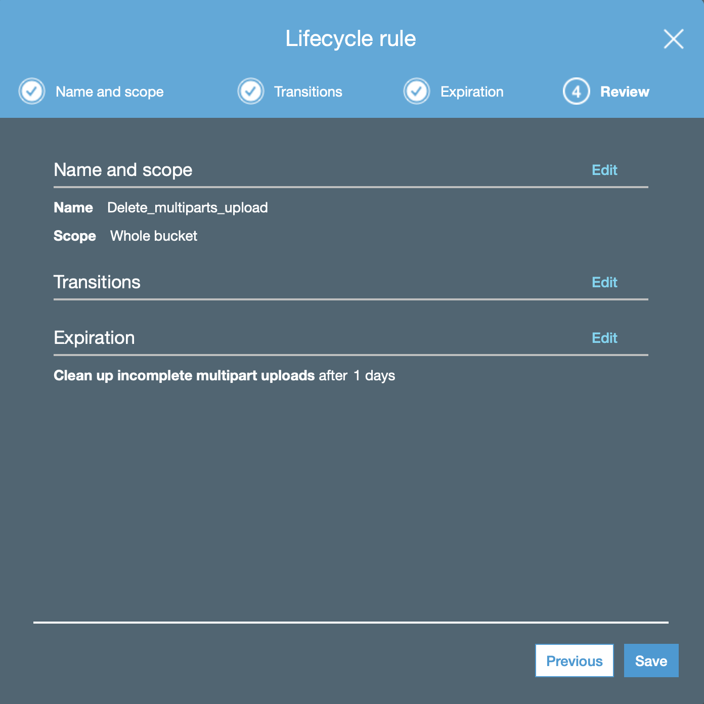
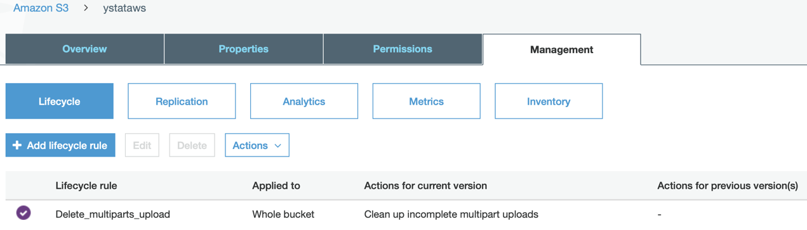

**主题：如何消除"Amazon Simple Storage Service
CNW1-TimedStorage-GlacierStaging"费用？**

**副标题：配置AWS
S3生命周期管理，用于删除S3分段上传生成部分所造成的费用**

**1）打开AWS 账单，发现"Amazon Simple Storage Service
CNW1-TimedStorage-GlacierStaging" 费用如下：**

{width="6.619717847769029in"
height="0.6392935258092738in"}

分析原因，是因为：采用AWS S3 上传下载工具（如MacOS：cyberduck，Windows：
S3 Browser），其上传原理为讲大文件拆成无数个小片段，使用并行上传的方式
-- 以提高上传效率。
假设上传意外中断（如点击停止），没有上传成功的大文件会变成
"未完成的S3上传部分"。久而久之，无用的数据积累越来越多，产生了新的费用。

[MacOS：cyberduck，Windows： S3 Browser 的使用方法请参考：]{.underline}

AWS S3 上传下载工具 - 配置与使用指南(AWS中国区测试可用)
<https://github.com/liangyimingcom/AWS-S3-upload-and-download-tool-configuration-and-usage-guide_available-for-AWS-China>

**2）由于在AWS控制台的S3界面中无法看到未完成的S3上传部分，使用CLI命令行来看：**

*aws s3api list-multipart-uploads \--bucket YourBucketName*

{width="6.570422134733159in"
height="1.2124857830271216in"}

我想知道未完成的文件总数：

*aws s3api list-multipart-uploads \--bucket YourBucketName
\| grep"所有者" \| wc -l*

{width="6.816901793525809in"
height="0.3894466316710411in"}

**3）确认存在未完成的多个S3上传部分，可以配置存储桶生命周期以中止上传并删除关联的S3部分。首先单击存储桶，然后单击管理。**

{width="4.75777012248469in"
height="2.9577471566054245in"}

添加生命周期规则，为您的规则命名，然后单击下一步。

{width="4.774429133858268in"
height="3.316901793525809in"}

我们不进行存储类转换，因此请单击下一步。

{width="4.397050524934383in"
height="4.408450349956255in"}

如下图配置，中止分段上传并设置您的期望天数。确保将天数设置为比上传文件所需的实际天数长，否则上传将被中止并在继续上传时被删除。单击查看页面的下一步。
（通常设置为1天较为合理）

{width="4.1551968503937005in"
height="4.1478871391076115in"}

查看设置，然后单击"保存"。

{width="4.619717847769029in"
height="4.619717847769029in"}

**4）完成存储桶生命周期配置工作，简单粗暴！S3分段上传的未完成部分 -
将在1天后被删除。**

{width="5.760563210848644in"
height="1.6492279090113735in"}

**更多参考：**

-   [list-multipart-uploads](https://docs.aws.amazon.com/cli/latest/reference/s3api/list-multipart-uploads.html)

-   [如何使用AWS CLI将文件分段上传到Amazon
    S3？](https://aws.amazon.com/premiumsupport/knowledge-center/s3-multipart-upload-cli/)

-   [使用存储桶生命周期策略中止不完整的分段上传](https://docs.aws.amazon.com/AmazonS3/latest/dev/mpuoverview.html#mpu-abort-incomplete-mpu-lifecycle-config)
